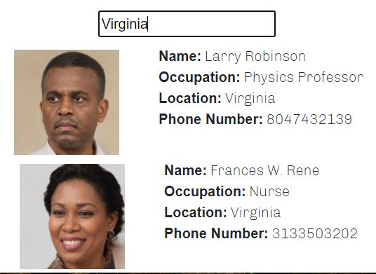

# Unit 19 React Homework: Employee Directory

[See this link for original commits, ran into errors when deploying previous repo](https://github.com/linneagear/React_EmployeeDirectory)
## Overview

This application is an employee directory that uses React. 

Given a table of random users, when the user loads the page, a table of employees should render. 

The user should be able to:

  * Sort the table by at least one category

  * Filter the users by at least one property.

## User Story
```
As a user, I want to be able to view my entire employee directory at once so that I have quick access to their information.
```

## Business Context

An employee or manager would benefit greatly from being able to view non-sensitive data about other employees. It would be particularly helpful to be able to filter employees by name.

## Installation
This project was bootstrapped by [Create React App](https://github.com/facebook/create-react-app).

Run `npm install` first, then `npm start` to run the app in the development mode. Open http://localhost:3000 to view it in the browser.

The page will reload if you make edits.

Find deployed link [here](https://wizardly-yonath-79f8ec.netlify.app/).

## Usage

User is given a set of employees that they are then able to sort by phone number:


Or scroll down to enter a search value:


## Issues
This was an extremely interesting activity to work on, and was the most fun I had in all homeworks, however I struggled with passing down props and connecting between components, so I wasn't able to solve how to both filter AND sort through the data.

I would change the entire app to be in a table instead, and filter and sort that way.

Also to keep the global state clean, I would replace my App.js code with JSX components/functions instead, which may help solve the above problems.

